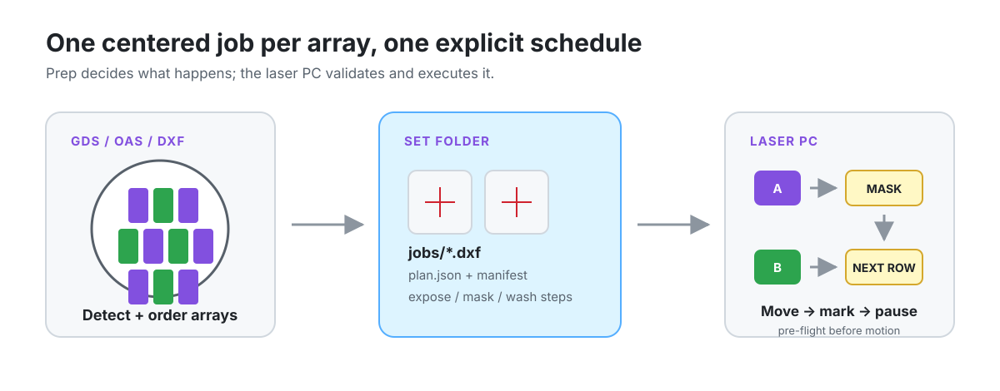

# UV Laser Exposure

Plan, center, and execute row-by-row backside UV-laser exposure of pinfin and
heater arrays on a 100 mm wafer.



The design computer converts a GDS/OAS/DXF layout into a portable **set folder**:
one field-centered DXF per array, an explicit exposure/masking schedule, and the
metadata needed by the offline laser PC. The run side then builds WinLase jobs,
moves a Prior OptiScan III stage to each target, and executes the schedule with
controlled mask or wash pauses.

> [!CAUTION]
> This software can command real stage motion and, when armed, fire a laser. Its
> coordinates, travel envelope, process table, and profile checks are specific to
> one machine. Use rated UV eyewear, the facility enclosure and interlocks, proper
> extraction, and the hardware emergency stop. A UI or keyboard stop is controlled
> shutdown logic, not an emergency stop.

## How it works

The codebase is deliberately split across two environments:

| Half | Runs on | Responsibilities |
| --- | --- | --- |
| Prep (`pflm/`, `prep_app/`) | Online design PC, Python 3.11+ | Inspect layers, detect array boxes and alignment marks, rotate and center geometry, build the schedule, preview, and write the set folder |
| Run (`laser_pc/`) | Offline Windows laser PC, Python 3.8+ | Load the plan, apply the backside-aware stage transform, build WinLase jobs, pre-flight targets, move the stage, mark arrays, and pause for masking/washing |

The only handoff between the two halves is the generated set folder. Prep code has
no hardware dependencies, and laser-PC code does not require KLayout, ezdxf, or
PySide6.

### Coordinate contract

- GDS coordinates are wafer-centered.
- Every job uses `(0, 0)` as the laser-field center. Arrays are normally centered
  there; a reachability clamp can deliberately retain a small, recorded field offset.
- WinLase auto-centering and fit-to-field scaling remain off.
- `plan.json` stores the post-rotation `exposed_center_um` used by the stage transform.
- Backside exposure mirrors X by default; rotation is explicit and recorded.
- The jig stays fixed while the stage moves the selected array beneath the galvo.

## Requirements

### Design/prep PC

```bash
pip install -r requirements-prep.txt
```

This installs KLayout’s Python API, ezdxf, and PySide6.

### Offline laser PC

- Windows and Python 3.8+
- WinLase Professional, dongle, scan card, and loaded lens calibration
- `pywin32` for WinLase COM
- `pyserial` preferred for the OptiScan controller; the driver can also use pywin32
- A machine-local `laser_pc/exposure_calibration.json`

The laser PC is designed to run without network access. Copy compatible wheels and
the built set folder onto the machine rather than installing the prep stack there.

## Quick start: build a set

Inspect a source layout before choosing layers:

```bash
python -m pflm.cli inspect wafer.gds
```

Build with the default layer contract (`pinfin=3/0`, `bbox=4/0`, `align=5/0`):

```bash
python -m pflm.cli build wafer.gds \
  --pinfin 3/0 \
  --bbox 4/0 \
  --align 5/0 \
  --set my-wafer
```

By default, designs are treated as already authored in the exposed frame
(`--rotation 0`), backside mode is recorded, physical rows are ordered top to
bottom, and arrays within each row use a stride-2 exposure/mask sequence. Use
`--jig-flat` only when a flat-down design must rotate to match the physical nest.

Important optional build modes:

- `--params <manifest.csv>` joins per-array passes, speed, fill style, angles,
  and hatch values from a design manifest.
- `--circles` writes round pins as true DXF `CIRCLE` entities.
- `--ablate-dead-space` prepends cell-minus-pin-field removal jobs and, by
  default, a wash pause before pinfin exposure.
- `--global-x` / `--global-y` apply a small field-frame correction once in the
  emitted DXFs.
- `--stride 1` exposes a complete row before each mask pause; the default is 2.

See all options with `python -m pflm.cli build --help`.

### Prep application

```bash
python prep_app/prep_app.py
```

The PySide6/QML app provides layer selection, rotation and process options, a
schedule preview, and set generation without composing the CLI command manually.

## Set-folder contract

Prep writes `output/sets/<name>/` unless `--output` is supplied:

```text
output/sets/<name>/
├── plan.json          # coordinate frames, arrays, etch metadata, and schedule
├── manifest.csv       # audit row for every emitted exposure job
├── prep_log.txt       # effective settings and warnings
├── jobs/
│   └── <array_id>.dxf # centered R2010 DXF, millimetres, layer 0
└── WinLaseJobs/       # added on the laser PC
    └── <set>_<array_id>.wlj
```

The builder warns on empty arrays, geometry outside array boxes, field-fit
failures, and stage-infeasible layouts. The laser PC repeats reachability checks
against its actual calibration before any motion.

The schedule is authoritative. It may contain:

- pinfin/heater array exposures grouped into physical rows and stride phases;
- controlled mask pauses between non-empty groups;
- optional dead-space removal followed by a wash pause;
- a final mask/wash boundary and alignment-mark exposures when marks are present.

## Run on the laser PC

Close the WinLase GUI before using its automation server.

```bash
# Parse the plan without COM, then verify the first job in memory.
python laser_pc/winlase_build_jobs.py output/sets/<name> --dry-run
python laser_pc/winlase_build_jobs.py output/sets/<name> --verify

# Build one .wlj per exposure job.
python laser_pc/winlase_build_jobs.py output/sets/<name>

# Print schedule, targets, and pre-flight verdict without motion.
python laser_pc/expose_wafer.py output/sets/<name> --list

# Real stage motion with simulated marking.
python laser_pc/expose_wafer.py output/sets/<name>

# Live laser run.
python laser_pc/expose_wafer.py output/sets/<name> --arm
```

For the operator UI, double-click [`laser_pc/run_ui.bat`](laser_pc/run_ui.bat).
It wraps the same CLI safety paths, streams logs and ETA updates, surfaces mask/wash
prompts, and supports controlled Stop/Resume flags. The UI defaults to re-datuming
before each move; the CLI default is `--redatum off`.

### Calibration and reachability

`laser_pc/exposure_calibration.json` is intentionally gitignored because it belongs
to the physical machine. It defines the wafer-to-stage reference, axis signs,
backside mirroring, reachable window, and optional offsets. If the file is absent,
`laser_pc/transform.py` falls back to the historical Singulation mapping
`stage_X = 5590 - wafer_X`, `stage_Y = -18450 + wafer_Y`; the code labels this an
**unverified starting point**, not a production calibration.

Verify the transform before exposure:

```bash
python laser_pc/transform.py --selftest
python laser_pc/optiscan.py info
python laser_pc/expose_wafer.py output/sets/<name> --list
```

The prep planner can clamp a target just outside the nominal stage window and place
the residual offset within the galvo field, up to its configured 2.5 mm array
tolerance. Larger excursions mark the set infeasible. The laser-PC pre-flight then
uses the machine-local calibration and refuses any remaining unreachable target.

### Process parameters and safety gates

Per-array passes and fill angles come from `plan.json` or the editable
`laser_pc/etch_params.json` table. The current pinfin defaults use 400 mm/s and
0.01 mm crosshatch; optional dead-space ablation uses its own faster,
bidirectional settings.

The job builder writes mark speed but never writes laser power or frequency. It
requires the active WinLase profile to read back at 100% power and 30 kHz and
aborts if the values change. Armed execution repeats profile checks before motion
and again at mark time, requires typed confirmation unless the UI has confirmed,
and runs a countdown. These are machine-specific gates, not recommended settings
for another process.

## Repository layout

| Path | Purpose |
| --- | --- |
| [`pflm/`](pflm) | Layer inspection, array detection, centering, DXF output, planning, and CLI |
| [`prep_app/`](prep_app) | PySide6/QML prep and schedule preview |
| [`laser_pc/`](laser_pc) | Stage transform/driver, WinLase job builder, sequenced runner, and Tk UI |
| [`design/`](design) | Wafer generators and the design-side etch-parameter table |
| [`docs/ARCHITECTURE.md`](docs/ARCHITECTURE.md) | Full schemas, coordinate frames, and module contract |

## Verification without hardware

The pure-math transform self-test runs without KLayout, WinLase, or a stage:

```bash
python laser_pc/transform.py --selftest
```

The WinLase builder’s `--dry-run` mode validates set discovery and parameter
resolution without COM. Hardware motion and live WinLase marking still require
qualification on the actual machine.

## License

No license file is provided. All rights are reserved.

